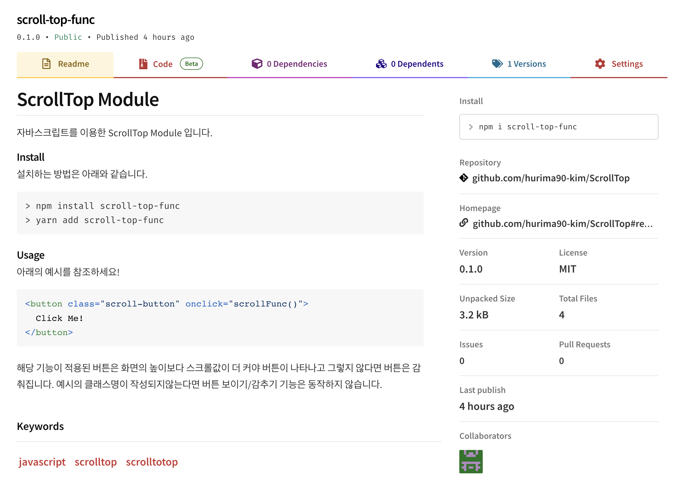

### 👉🏻 노마드코더 주말 스프린트! 처음으로 npm 라이브러리 만들어보기!

현 직장에 다닌지 어느덧 1년 7개월이 흘렀습니다. 
나태해졌다 생각이 든 순간 이 블로그를 개발하였는데 그뒤로 안좋은 일도 겹쳐 겨울이 지나 여름이 다되도록 
공부와 손절하고 지내던중 슬랙에 뜬 알림을 보고 "이거다!"싶어 비루한 실력으로 주말 스프린트에 참여하게 되었습니다.  

소개에 앞서 이렇게 좋은 기회를 제공해주신 노마드코더의 Lynn님, Pengoose님 정말 감사합니다. 😍  

토요일 오전에 간단한 세션을 진행할때까지 어떤기능을 만들어야되는지 아이디어가 떠오르지 않던중 
현업에서 사용하는 라이브러리들처럼 기능이 많고 거창하지 않아도 된다는 말에 떠오른 몇가지중! 
최근 회사에서 작업중에 상당히 귀찮다고 생각되는 기능이 떠올랐습니다.  

그것은 바로! 굉장히 간단하지만 매번 복붙을 해서 사용하는 scrollTop 기능이었습니다. 
이미 다른 개발자분들이 만들어놓은게 많지만 제가 스스로 만들어서 사용하면 더 이해하기 편하고 좋을것 같더라구요. 
(그건 니 생각이야...)🤣  

처음부터 너무 많은 기능과 완벽성을 추구하면 왠지 멘탈이 나갈것만 같은 느낌... 
그래서 진짜 너무나 세상 간단한 기본기능으로만 구현해보았습니다. 

테스트도 여러번 해보아야하고 아직 할일이 좀더 많이 남아있지만 
막상 진행해보니 생각보다 어렵진않았습니다. 시작도 전에 지레 겁먹고 도전을 안해봤는데 자신감이 아주 쪼금 생겼어요 🤩  
**이렇게 간단한 라이브러리를 만들어서 배포해보았습니다.**

👏🏻👏🏻👏🏻   

타입스크립트로 변경하고 좀더 세분화시켜 좀더 사용하기 편하고 좋은 기능을 추가하는 것을 시작으로 
블로그 개발할때 마음가짐으로 돌아가서 글도 작성하며 계속 도전하고 공부하도록 하겠습니다.   

**감사합니다. 🙇🏻‍♂️**
